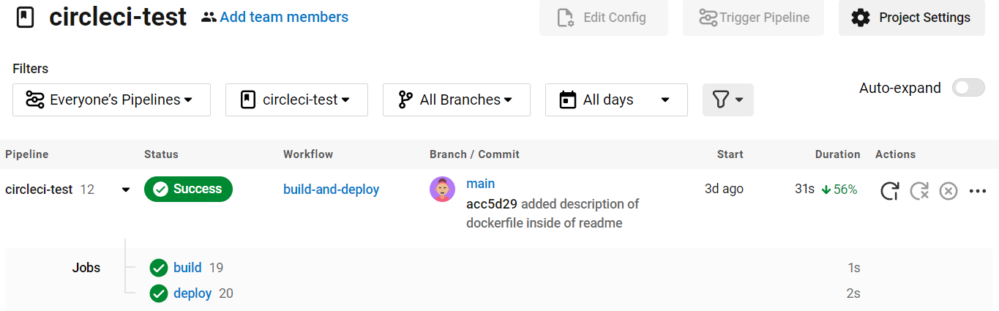

# Intro
This project aims to introduce the concepts of ci/cd.
The purpose of this code is to automate the process of building and deploying a Docker image using CircleCI.

Requirements
1. create a new repository on github.
2. have an account in circleci (sing up with the github option so that the accounts are linked and with each change the trigger is produced so that circleci builds and deploys in Dockerhub).
4. Create an account on Dockerhub.

Steps:
  1. create a new repository on github and clone it to your local machine.
  2. Open an IDE with the repository created.
  3. Create a Dockerfile file
    - Within the Dockerfile, the Ubuntu 20.041 image will be established as a base, to build a new image.<br>The base image contains an operating system and a preconfigured environment that will be used as the basis for your application or service. In this case, the base image is Ubuntu 20.04, which is a specific version of Ubuntu Linux1. <br>An images allows you to focus on adding and configuring the specific components of your application or service without having to worry about basic operating system configuration.<br> With Docker, you can manage your infrastructure in the same ways you manage your applications.<br>

 4. inside the repository create a folder called .circleci and inside it the config.yml file<br>
    
    
 5.  Access the Circleci account to synchronize projects.
    - Select the left tab that says "Projects"
    - Search for your project, which you want to work on, if necessary.
    - click on "set up project".
    - Select your config.yml file.
    - write the branch.
    - Summit.
6. Go back to the IDE and you modify the config.yml:
Within the code, update your username of 
your Dockerhub account, on lines 26 and 27.
```
docker image tag circleci:latest  beatrizi/circleci:latest
docker image push beatrizi/circleci:latest
```
7. Save the change, commit and push.
8. Go back to Circleci Repository, Observe how the pipeline is executed.
    
9. Go back the repository in Github and notice that a green tick appears next to the last commit.
    